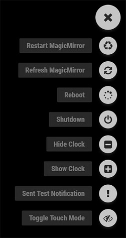
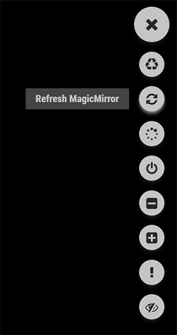

# MMM-OnScreenMenu - Simple On-Screen Menu for controlling the MagicMirror²

This is a module for the [MagicMirror²](https://github.com/MichMich/MagicMirror/).

The MMM-OnScreenMenu Module provides a small, customizable, material-style floating action button menu for controlling the MagicMirror².

View the live demo/mockup here: https://codepen.io/shbatm/pen/OggMbr/

Basic Functions:

1. Control the power to the screen (On/Off/Toggle).
2. Manage the Mirror (Shutdown/Reboot/Restart MM², Refresh/Minimize Window, Toggle Fullscreen mode, Open DevTools).
3. Module Visibility (Show/Hide/Toggle).
4. Send Notifications to Other Modules:
    * Switch Profiles in [MMM-ProfileSwitcher](https://github.com/tosti007/MMM-ProfileSwitcher)
    * Perform other module functions from a button in the menu.

The menu is designed to be controllable from multiple devices:

* Mouse Control
* Touchscreen Control
* Keyboard Control
* Bluetooth Remote via [MMM-KeyBindings](https://github.com/shbatm/MMM-KeyBindings)
* Module Notifications from other modules

## Screenshots

  
<br>*Left: Touch Mode; Middle: Hidden/Mouseover Mode; Right: Demo*


## Installation

```shell
cd ~/MagicMirror/modules
git clone https://github.com/shbatm/MMM-OnScreenMenu
cd MMM-OnScreenMenu/
npm install
```

## Using the module

To use this module, add the following configuration block to the modules array in the `config/config.js` file:
```js
var config = {
    modules: [
        {
            module: 'MMM-OnScreenMenu',
            position: 'bottom_right',
            /* Valid positions: 'top_right', 'top_left', 'bottom_right', 'bottom_left' */
            config: {
                touchMode: true,
                enableKeyboard: true,
                // ... see more options below
            }
        }
    ]
}
```

## Configuration options

| Option                | Description
|-----------------------|-----------
| `menuName` | *Optional* - Set the name of the menu. Only needs to be changed if using multiple instances of the module.<br>*Default:* `"MAIN"`.
| `touchMode` | *Optional* - Enable Touch Mode for the menu.<br>When enabled, the menu button will always be visible and all tooltips will be shown when the menu is open.<br>When disabled, the menu will only appear when hovered over, clicked, or opened with a menu key.<br>*Default:* `true`
| `enableKeyboard` | *Optional* - Enable basic keyboard control.<br>Menu can be controlled with the `ContextMenu` key (usually next to `Right-Alt`), Arrow Up/Down, and Enter.<br>*Default:* `true`<br><br>*To customize keys:* manually edit the `setupMousetrap` function in `MMM-OnScreenMenu.js`.
| `enableKeyBindings` | *Optional* - Enable integration with [MMM-KeyBindings](https://github.com/shbatm/MMM-KeyBindings) for bluetooth remote and better keyboard control.  See [KeyBindings Config](#keybindings-config) below.
| `menuItems` | See [Menu Items](#menu-items) below.
| `pm2ProcessName` | The pm2 Process Name to control using `STOP` and `RESTART` menu items. <br>*Default:* `"mm"`

### Menu Items <a name="menu-items"></a>

#### Default Menu:
To customize, add the whole block to the module config and customize. 

```js
menuItems: {
    monitorOff: { title: "Turn Off Monitor", icon: "television", source: "SERVER" },
    refresh: { title: "Refresh", icon: "recycle", source: "LOCAL" },
    restart: { title: "Restart MagicMirror", icon: "refresh", source: "ALL" },
    reboot: { title: "Reboot", icon: "spinner" },
    shutdown: { title: "Shutdown", icon: "power-off" }
},
```

#### Menu Item Configurations:

| Option | Description
| ------ | -----------
| `title` | The title to show when hovered over.
| `icon` | The [Font Awesome](http://fontawesome.io/icons/) icon to use.
| `source` | *Optional* - When to show the menu item:<br>&nbsp;&nbsp;&bull;&nbsp;&nbsp;`"ALL"` or omitted: on any instance of the MM²<br>&nbsp;&nbsp;&bull;&nbsp;&nbsp;`"SERVER"`: only the main MM² screen<br>&nbsp;&nbsp;&bull;&nbsp;&nbsp;`"LOCAL"`: only when viewing the mirror from a remote browser window.
| `name` | *Module Menu Items Only* - The module name to control
| `notification` | *Notify Menu Items Only* - The notification title to send.
| `payload` | *Notify Menu Items Only* - The notification payload to send.

#### Available Menu Items:

+ Monitor/Screen Power Control:
    * Turn Screen On - `monitorOn`
    * Turn Screen Off - `monitorOff`
    * Toggle Screen Power - `monitorToggle`
+ System Control:
    * Refresh the browser page - `refresh`
    * Minimize the browser window (if using `electron`) - `minimize`
    * Toggle Fullscreen Mode (if using `electron`) - `toggleFullscreen`
    * Open DevTools window (if using `electron`) - `openDevTools`
    * Reload the MM² script (if using `pm2`) - `restart`
    * Stop the MM² script (if using `pm2`) - `stop`
    * Reboot the server - `reboot`
    * Shutdown the server - `shutdown`
    * *Default commands are for running MM² using PM2 & Electron on Debian Linux (Raspian); e.g. the default installation. You can customize `reboot`, `shutdown`, `restart` commands as needed in `node_helper.js`. and set the PM2 process name using the `pm2ProcessName` config option (Default: "mm")*
+ Module Control:
    * Hide a module - `moduleHideX` 
    * Show a module - `moduleShowX`
    * Toggle module visibility - `moduleToggleX`
    * *`X` is a unique number for each item, e.g. `moduleHide1` for the first hide module item*
    * *Add module's name to the menu item definition (see Menu Item Configurations above)*
    * *If you have multiple instances of a module, add an instance name to both that module's config and the menu item (see third example below)*
    * Examples:
        ```js
        moduleHide1: { title: "Hide Clock", icon: "minus-square", name: "clock" },
        moduleShow1: { title: "Show Clock", icon: "plus-square", name: "clock" },
        moduleToggle1: { title: "Toggle iFrame", icon: "info-circle", name: "MMM-iFrame", instance: "Frame1"}
           # For example above, in MMM-iFrame-s config section, you also need to add `instance: "Frame1"`
        ```
+ Notifications:
    * Send a Module Notification to another module - `notifyX`
    * *`X` is a unique number for each item, e.g. `notify1` for the first notification item*
    * Example - Change profile on MMM-ProfileSwitcher:
        ```js
        notify1: {  title: "Switch to Profile", 
                    icon: "eye", 
                    notification: "CURRENT_PROFILE", 
                    payload: "DESIRED_PROFILE_NAME_HERE" },
        ```
+ Change Menu Visibitliy/Mode:
    * Toggle Touch Mode: `toggleTouchMode`
    * Move the Menu: `changeMenuPosition_<NEW_POSITION>`
    * Examples:
        ```js
        toggleTouchMode: { title: "Toggle Touch Mode", icon: "eye-slash" }
        changeMenuPosition_top_right: { title: "Move Menu to Top Right", icon: "arrows" }
        ```
+ Delayed Actions:
    * Perform any of the above actions after a delay - `delayedX`
    * *`X` is a unique number for each item, e.g. `delayedX` for the first delayed item*
    * Example - Refresh the browser page after 5 seconds
        ```js
        delayed1: {  title: "Delayed Refresh",
                     icon: "recycle",
                     action: "refresh", // Name of action to perform
                     delay: 5000, // Delay in ms
                  } 
        ```
    * Repeatedly calling the menu item restarts the timer.
    * To add a menu item that cancels a previously started delay, create a second unique menu item (e.g. `delayed2`) and add `actionName: 'itemToCancel', abort: true` to it's config.
    * Example - Cancel the delayed refresh example above:
        ```js
        delayed2: {  title: "Cancel Refresh",
                     icon: "cancel",
                     actionName: "delayed1",
                     abort: true,
                  } 
        ```


#### Calling actions from another module

Any valid menu item can be called from another module by sending a notification similar to the one below. *Note:* The item passed does NOT actually need to be in the menu's config; it just needs to be valid in the context listed above.

```js
// Basic Action Item Notification
this.sendNotification('ONSCREENMENU_PROCESS_ACTION', 'menuItemName');
// Advanced Action Item Notification (e.g. module show/hide control, etc.), send payload as an object with the relevent details required.
//     Example 1: Toggle Clock Module via Notification
this.sendNotification('ONSCREENMENU_PROCESS_ACTION', { actionName:'moduleToggle1', name: 'clock'})
//     Example 2: Turn monitor off after a 60-second delay
this.sendNotification('ONSCREENMENU_PROCESS_ACTION', { actionName:'delayed1', action:'monitorOff', delay: 60000})
```

#### Sample Configuration (Default)

You can copy and paste the following into your config file modules section for a starting point.

```js
{
    module: 'MMM-OnScreenMenu',
    position: 'bottom_right',
    /* Valid positions: 'top_right', 'top_left', 'bottom_right', 'bottom_left' */
    config: {
        touchMode: true,
        menuItems: {
            monitorOff: { title: "Turn Off Monitor", icon: "television", source: "SERVER" },
            restart: { title: "Restart MagicMirror", icon: "recycle", source: "ALL" },
            refresh: { title: "Refresh MagicMirror", icon: "refresh", source: "LOCAL" },
            reboot: { title: "Reboot", icon: "spinner", source: "ALL" },
            shutdown: { title: "Shutdown", icon: "power-off", source: "ALL" },
        },
        enableKeyboard: true,
    }
},
```

#### Controlling the Menu from another module

The menu can be controlled via notifications from another module, for instance buttons using the [MMM-MPR121](https://github.com/PatriceG/MMM-MPR121) module. 

To toggle the menu open/closed:
```js
this.sendNotification('ONSCREENMENU_TOGGLE_MENU', '') // Single Menu
this.sendNotification('ONSCREENMENU_TOGGLE_MENU', { menuName: "MAIN" }) // Multiple Menus
```

To select an item by it's position in the list, zero-based (e.g. 3rd down = 2):
```js
this.sendNotification('ONSCREENMENU_BY_NUMBER', 1) // 2nd item, single menu
this.sendNotification('ONSCREENMENU_BY_NUMBER', 
    { menuName:"MAIN",
      itemNumber: 1
    }) // 2nd item, multiple menus
```

To navigate up/down/select using notifications, set `enableKeyBindings: true` in your config (even if you are not using the KeyBindings module) and use the following notification format:

    Notification: 'KEYPRESS'
    Payload: *see section below for keynames (e.g. ArrowUp for up)*

#### KeyBindings Config <a name="keybindings-config"></a>

The default configuration for [MMM-KeyBindings](https://github.com/shbatm/MMM-KeyBindings) is below. This can be customized by adding to the normal module config.

```js
        // MMM-KeyBindings Settings
        enableKeyBindings: false,
        keyBindingsMode: "OSM",
        keyBindings: {
            Up: "ArrowUp",
            Down: "ArrowDown",
            Select: "Enter",
            Close: "Return",
            Menu: "Menu"
        },
        kbMultiInstance: true,
        keyBindingsTakeFocus: "Menu"
```

## Development Path

This module is an ever-continuing work in progress, if you would like to request a feature or report a bug, please see the [Issues](https://github.com/shbatm/MMM-OnScreenMenu/issues).